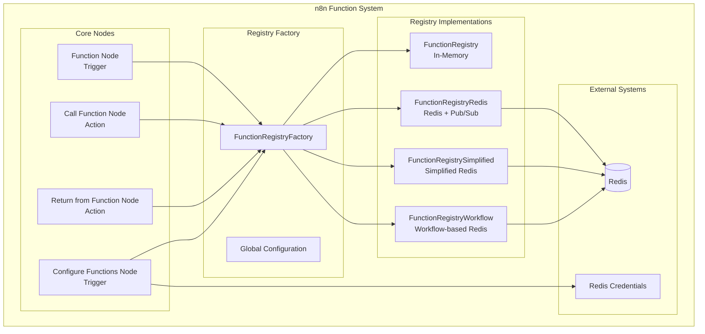
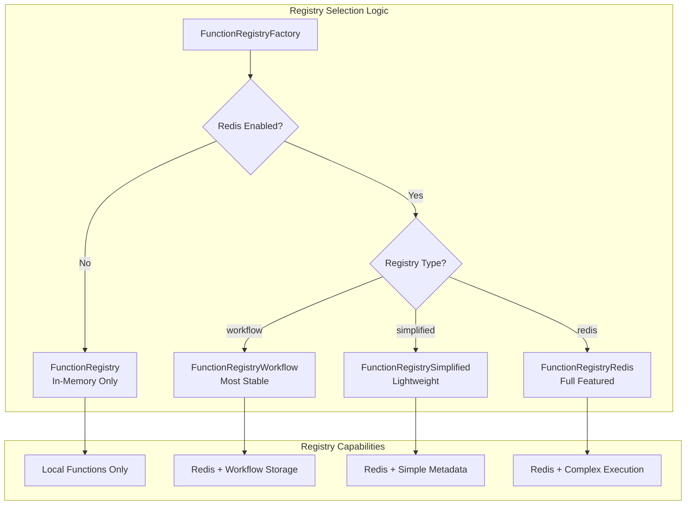
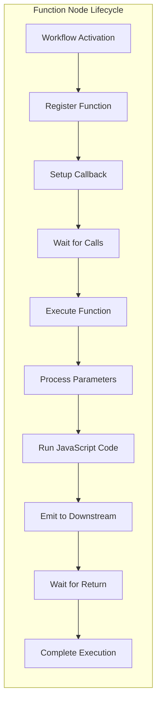
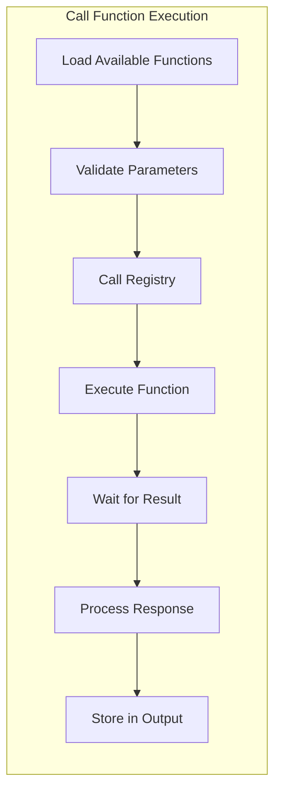
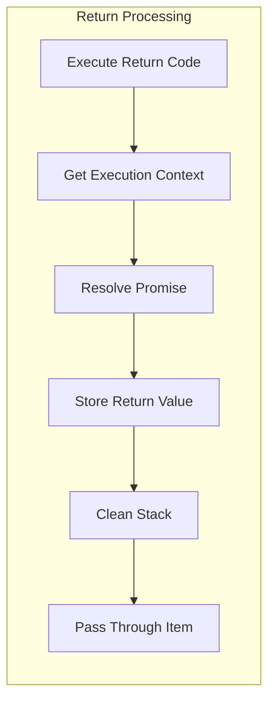
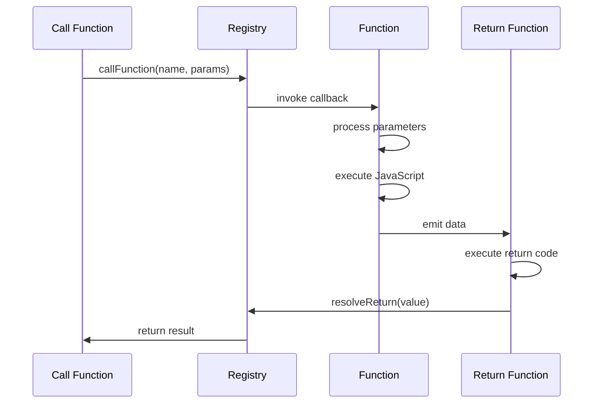
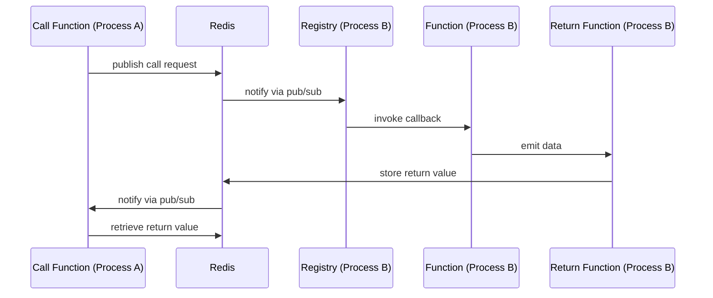
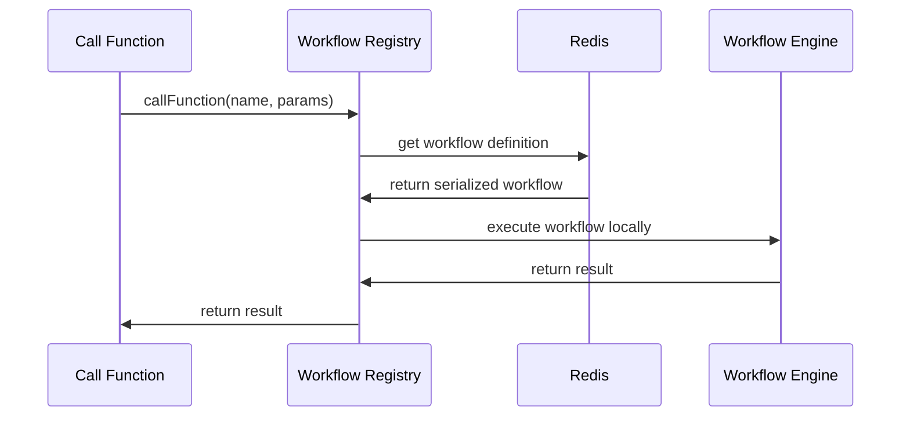

# ABOUT_THE_NODES.md

## Overview

This project is an **n8n custom nodes package** that implements a sophisticated, modular function system for n8n workflows. It enables defining, calling, and returning from reusable functions with support for both local (in-memory) and distributed (Redis-backed) execution modes. The architecture is designed for maximum flexibility, scalability, and cross-workflow communication.

---

## Table of Contents

- [Architecture Overview](#architecture-overview)
- [Registry System Architecture](#registry-system-architecture)
- [File-by-File Breakdown](#file-by-file-breakdown)
- [Node-by-Node Breakdown](#node-by-node-breakdown)
- [Execution Flow Diagrams](#execution-flow-diagrams)
- [Core Features](#core-features)
- [Configuration Options](#configuration-options)
- [Use Cases](#use-cases)
- [Technical Implementation Details](#technical-implementation-details)

---

## Architecture Overview

---

## Registry System Architecture

The system uses a **factory pattern** with four different registry implementations:

---

## File-by-File Breakdown

### 📁 Credentials

#### [`credentials/FunctionsRedisCredentials.credentials.ts`](credentials/FunctionsRedisCredentials.credentials.ts:1)
- **Purpose**: Defines Redis connection credentials for distributed execution
- **Configuration Fields**:
  - `host`: Redis server hostname/IP (default: "redis")
  - `port`: Redis server port (default: 6379)
  - `database`: Redis database number (default: 0)
  - `user`: Redis username (optional)
  - `password`: Redis password (optional)
  - `ssl`: Enable SSL/TLS connection (default: false)
- **Interface**: [`FunctionsRedisCredentialsData`](credentials/FunctionsRedisCredentials.credentials.ts:72)

### 🏗️ Registry System

#### [`nodes/FunctionRegistry.ts`](nodes/FunctionRegistry.ts:1) - Base In-Memory Registry
- **Purpose**: Default singleton registry for local function execution
- **Key Features**:
  - In-memory function storage with [`Map<string, FunctionListener>`](nodes/FunctionRegistry.ts:21)
  - Promise-based return value handling via [`createReturnPromise()`](nodes/FunctionRegistry.ts:244)
  - Execution stack management for nested calls
  - Unique call ID generation for function invocations
- **Core Methods**:
  - [`registerFunction()`](nodes/FunctionRegistry.ts:35): Register function with callback
  - [`callFunction()`](nodes/FunctionRegistry.ts:61): Execute function with parameters
  - [`setFunctionReturnValue()`](nodes/FunctionRegistry.ts:156): Store return values
  - [`getFunctionReturnValue()`](nodes/FunctionRegistry.ts:172): Retrieve return values

#### [`nodes/FunctionRegistryRedis.ts`](nodes/FunctionRegistryRedis.ts:1) - Full Redis Registry
- **Purpose**: Redis-backed registry with pub/sub for cross-process execution
- **Key Features**:
  - Redis connection management with automatic reconnection
  - Cross-process function calls via Redis pub/sub channels
  - Function metadata storage in Redis with TTL
  - Return value caching with 5-minute expiry
- **Redis Keys**:
  - Function metadata: `function:{executionId}:{functionName}`
  - Return values: `return:{executionId}`
  - Pub/sub channels: `function-call:{functionName}:{executionId}`
- **Advanced Features**:
  - Automatic timeout handling (30s for function calls)
  - Duplicate client management for pub/sub
  - Error propagation across processes

#### [`nodes/FunctionRegistrySimplified.ts`](nodes/FunctionRegistrySimplified.ts:1) - Simplified Redis Registry
- **Purpose**: Lightweight Redis implementation with simplified key structure
- **Key Improvements**:
  - Eliminates complex execution ID logic
  - Uses simple function names as keys
  - Workflow ID-based scoping instead of execution ID
  - Automatic cleanup and simpler lookup
- **Redis Keys**:
  - Global functions: `function:global:{functionName}`
  - Workflow functions: `function:workflow:{workflowId}:{functionName}`
  - Return values: `return:{callId}`
- **Pub/Sub Channels**:
  - Function calls: `function:call:{functionName}`
  - Responses: `function:response:{callId}`

#### [`nodes/FunctionRegistryWorkflow.ts`](nodes/FunctionRegistryWorkflow.ts:1) - Workflow-Based Registry
- **Purpose**: Most stable implementation storing complete workflow definitions
- **Key Features**:
  - Stores entire function workflow fragments in Redis
  - True cross-process execution using n8n's workflow engine
  - Stateless and portable function definitions
  - No memory coupling between processes
- **Workflow Storage**: [`SerializedFunctionDefinition`](nodes/FunctionRegistryWorkflow.ts:12) interface
  - Function metadata, parameters, nodes, connections
  - JavaScript code and execution settings
  - Creation timestamps and global flags
- **Benefits**:
  - Uses n8n's battle-tested workflow execution engine
  - Complete function portability across instances
  - Maximum stability and reliability

#### [`nodes/FunctionRegistryFactory.ts`](nodes/FunctionRegistryFactory.ts:1) - Registry Factory & Configuration
- **Purpose**: Central factory for registry selection and global configuration
- **Global Configuration**: Persisted via [`globalThis.__n8nFunctionsGlobalConfig`](nodes/FunctionRegistryFactory.ts:10)
- **Configuration Persistence**:
  - In-memory global variables
  - Redis storage for cross-process persistence
  - Automatic config loading on startup
- **Registry Selection Logic**:
  - Auto-detects Redis availability
  - Supports manual registry type selection
  - Defaults to workflow registry for maximum stability
- **Key Functions**:
  - [`getFunctionRegistryAsync()`](nodes/FunctionRegistryFactory.ts:251): Async registry retrieval
  - [`enableRedisMode()`](nodes/FunctionRegistryFactory.ts:263): Enable Redis with host
  - [`setRedisHost()`](nodes/FunctionRegistryFactory.ts:120): Configure Redis connection

### 🎯 Core Nodes

#### [`nodes/Function/Function.node.ts`](nodes/Function/Function.node.ts:1) - Function Definition Node
- **Type**: Trigger Node
- **Purpose**: Define callable functions within workflows
- **Configuration Options**:
  - **Global Function**: [`globalFunction`](nodes/Function/Function.node.ts:32) - Cross-workflow availability
  - **Parameters**: [`parameters`](nodes/Function/Function.node.ts:38) - Typed parameter definitions
  - **Code Execution**: [`enableCode`](nodes/Function/Function.node.ts:118) - Optional JavaScript execution
- **Parameter System**: [`ParameterDefinition`](nodes/FunctionRegistry.ts:3) interface
  - Name, type (string/number/boolean/object/array), required flag
  - Default values and descriptions
  - Type validation and conversion
- **Execution Flow**:
  1. Register function with registry on workflow activation
  2. Set up callback for function invocation
  3. Handle parameter processing and code execution
  4. Manage promise-based return value coordination

#### [`nodes/CallFunction/CallFunction.node.ts`](nodes/CallFunction/CallFunction.node.ts:1) - Function Invocation Node
- **Type**: Action/Transform Node
- **Purpose**: Call registered functions with parameters
- **Dynamic Discovery**: [`getAvailableFunctions()`](nodes/CallFunction/CallFunction.node.ts:170) method
  - Loads available functions from registry
  - Supports global vs local function filtering
  - Provides helpful messages when no functions available
- **Parameter Modes**:
  - **Individual**: [`parameterMode: "individual"`](nodes/CallFunction/CallFunction.node.ts:61) - Separate parameter fields
  - **JSON**: [`parameterMode: "json"`](nodes/CallFunction/CallFunction.node.ts:67) - Single JSON object
- **Parameter Validation**: [`getFunctionParameters()`](nodes/CallFunction/CallFunction.node.ts:213)
  - Dynamic parameter loading based on selected function
  - Type validation and conversion
  - Invalid parameter detection and filtering
- **Response Handling**:
  - Optional response storage in output item
  - Configurable response variable name
  - Error handling with continue-on-fail support

#### [`nodes/ReturnFromFunction/ReturnFromFunction.node.ts`](nodes/ReturnFromFunction/ReturnFromFunction.node.ts:1) - Function Return Node
- **Type**: Action/Transform Node
- **Purpose**: Return values from function execution
- **JavaScript Execution**: [`returnCode`](nodes/ReturnFromFunction/ReturnFromFunction.node.ts:22) parameter
  - Full JavaScript code editor with syntax highlighting
  - Access to `$json`, `$binary`, `$index`, `$item` variables
  - Custom console logging for debugging
- **Promise Resolution**:
  - Resolves function promises via [`resolveReturn()`](nodes/ReturnFromFunction/ReturnFromFunction.node.ts:139)
  - Handles execution stack cleanup
  - Error propagation for failed return code execution
- **Execution Context Management**:
  - Retrieves current function execution ID from registry
  - Manages execution stack via [`popCurrentFunctionExecution()`](nodes/ReturnFromFunction/ReturnFromFunction.node.ts:155)
  - Handles both successful returns and error cases

#### [`nodes/ConfigureFunctions/ConfigureFunctions.node.ts`](nodes/ConfigureFunctions/ConfigureFunctions.node.ts:1) - Global Configuration Node
- **Type**: Trigger Node
- **Purpose**: Configure global function system settings
- **Configuration Options**:
  - **Redis Mode**: [`useRedis`](nodes/ConfigureFunctions/ConfigureFunctions.node.ts:30) - Enable Redis-backed execution
  - **Connection Testing**: [`testConnection`](nodes/ConfigureFunctions/ConfigureFunctions.node.ts:37) - Validate Redis connectivity
  - **Registry Type**: [`registryType`](nodes/ConfigureFunctions/ConfigureFunctions.node.ts:49) - Select implementation
- **Registry Types**:
  - **Workflow Registry**: Most stable, stores complete workflow definitions
  - **Simplified Registry**: Lightweight with metadata-only storage
  - **Full Redis Registry**: Complex execution tracking with pub/sub
- **Global Persistence**:
  - Updates [`globalThis.__n8nFunctionsGlobalConfig`](nodes/FunctionRegistryFactory.ts:10)
  - Saves configuration to Redis for cross-process persistence
  - Affects ALL workflows in the n8n instance
- **Connection Testing**:
  - Validates Redis connectivity on activation
  - Emits configuration status events
  - Provides detailed error information

---

## Node-by-Node Breakdown

### Function Node Details

**Key Features:**
- **Parameter Processing**: Type conversion, default values, validation
- **Code Execution**: Optional JavaScript with parameter injection
- **Promise Coordination**: Waits for return values or detects void functions
- **Stack Management**: Tracks execution context for nested calls

### Call Function Node Details

**Dynamic Features:**
- **Function Discovery**: Real-time loading of available functions
- **Parameter Validation**: Type checking and conversion
- **Fallback Logic**: Tries multiple execution contexts
- **Error Handling**: Graceful failure with detailed error information

### Return from Function Node Details

**Advanced Features:**
- **JavaScript Execution**: Full code editor with context variables
- **Promise Resolution**: Coordinates with waiting function calls
- **Error Handling**: Propagates errors through promise rejection
- **Stack Cleanup**: Maintains proper execution context

---

## Execution Flow Diagrams

### Local Function Execution

### Cross-Process Redis Execution

### Workflow Registry Execution

---

## Core Features

### Parameter System
- **Type Safety**: Strongly typed with validation ([`ParameterDefinition`](nodes/FunctionRegistry.ts:3))
- **Default Values**: Automatic type conversion and fallback values
- **Flexible Input**: Individual parameters or JSON object mode
- **Dynamic Discovery**: Real-time parameter loading based on function selection

### Execution Modes
- **Local**: In-memory function calls within same workflow/process
- **Global**: Cross-workflow function sharing within same n8n instance
- **Distributed**: Redis-backed cross-process execution across n8n instances
- **Workflow-Based**: Complete workflow definition storage and execution

### Return Value Handling
- **Promise-Based**: Async coordination via [`createReturnPromise()`](nodes/FunctionRegistry.ts:244)
- **Void Function Detection**: Automatic detection of functions without return values
- **Error Propagation**: Robust error handling via [`rejectReturn()`](nodes/FunctionRegistry.ts:310)
- **TTL Management**: Automatic cleanup of stored return values

### Redis Integration
- **Pub/Sub**: Cross-process function calls via Redis channels
- **Metadata Storage**: Function definitions with automatic expiry
- **Return Value Caching**: Temporary storage with configurable TTL
- **Global Configuration**: Persistent settings across n8n instances
- **Connection Management**: Automatic reconnection and error handling

---

## Configuration Options

### Registry Selection
- **In-Memory**: Default for single-instance deployments
- **Redis**: Full-featured with complex execution tracking
- **Simplified**: Lightweight Redis with simplified key structure
- **Workflow**: Most stable, stores complete workflow definitions

### Redis Configuration
- **Host/Port**: Configurable Redis connection details
- **Authentication**: Optional username/password authentication
- **SSL/TLS**: Secure connection support
- **Database Selection**: Multiple Redis database support

### Global Settings
- **Queue Mode**: Enables Redis-backed distributed execution
- **Registry Type**: Selects specific registry implementation
- **Auto-Detection**: Automatic Redis availability detection
- **Cross-Process Persistence**: Configuration sharing across n8n instances

---

## Use Cases

### 1. Code Reusability
- Define common business logic once
- Reuse across multiple workflows
- Centralized function management
- Version control for function definitions

### 2. Microservices Architecture
- Distributed function execution across n8n instances
- Service-oriented workflow design
- Load balancing across multiple workers
- Fault tolerance and redundancy

### 3. Complex Workflow Modularization
- Break down large workflows into manageable functions
- Improved readability and maintainability
- Easier testing and debugging
- Parallel execution capabilities

### 4. Cross-Workflow Communication
- Share functions between different workflows
- Global function libraries
- Workflow orchestration patterns
- Event-driven architectures

### 5. Queue Processing
- Scalable, Redis-backed function calls
- Asynchronous processing patterns
- Worker pool implementations
- High-throughput data processing

---

## Technical Implementation Details

### Memory Management
- Singleton pattern for registry instances
- Automatic cleanup of expired return values
- Stack-based execution context tracking
- Promise cleanup to prevent memory leaks

### Error Handling
- Graceful degradation when Redis is unavailable
- Comprehensive error propagation
- Timeout handling for cross-process calls
- Detailed error logging and debugging

### Performance Optimizations
- Connection pooling for Redis clients
- Efficient key-value storage patterns
- Minimal serialization overhead
- Optimized pub/sub channel usage

### Security Considerations
- Redis authentication support
- SSL/TLS encryption for Redis connections
- Sandboxed JavaScript execution
- Parameter validation and sanitization

---

## Summary

This architecture provides a robust, enterprise-grade foundation for building modular, reusable, and scalable n8n workflows with function-based programming paradigms. It supports everything from simple single-instance deployments to complex distributed systems with multiple n8n instances, offering advanced features like queue processing, cross-workflow logic sharing, and microservices-style architectures.

The system's flexibility allows teams to start with simple in-memory functions and gradually scale to distributed Redis-backed execution as their needs grow, all while maintaining backward compatibility and providing multiple implementation options for different use cases.