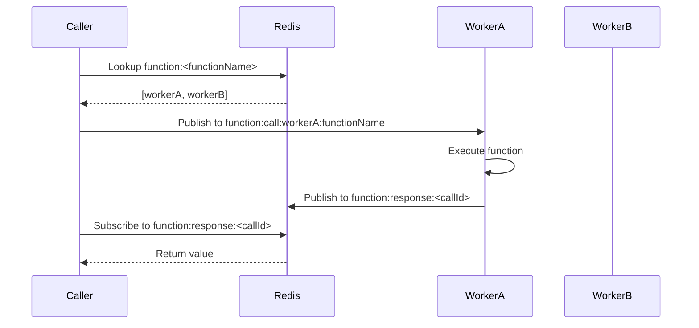

# How to Actually For Real Make Function Nodes Work in n8n in Queue Mode

This document outlines a practical, scalable, and queue-mode-compatible architecture for making Function Nodes work across distributed n8n workers using Redis. It builds on the findings in `FRANKENSTEIN_FINDINGS_AND_RECOMMENDATIONS.md`.

---

## 🧠 Core Goals

- Allow function nodes to call each other across workflows and processes
- Support n8n's queue mode (multiple workers, Redis coordination)
- Ensure return values are routed back to the caller
- Avoid race conditions, missed messages, and memory leaks

---

## ✅ Recommended Architecture

### 🔁 Redis Pub/Sub with Worker Routing

Each worker:
- Registers functions in Redis
- Subscribes to `function:call:<workerId>:<functionName>`
- Publishes results to `function:response:<callId>`

The caller:
- Looks up available workers for a function
- Picks one (round-robin or random)
- Publishes to `function:call:<workerId>:<functionName>`
- Subscribes to `function:response:<callId>` and waits

### 🧬 Redis Key Schema

| Key                                       | Purpose                                         |
| ----------------------------------------- | ----------------------------------------------- |
| `function:<functionName>`                 | Set of worker IDs that can handle this function |
| `function:meta:<workerId>:<functionName>` | Metadata (params, nodeId, etc)                  |
| `function:call:<workerId>:<functionName>` | Pub/sub channel for function calls              |
| `function:response:<callId>`              | Pub/sub channel for function results            |
| `return:<executionId>`                    | Return value storage                            |
| `return-pubsub:<executionId>`             | Return value pub/sub channel                    |

---

## 🧭 Flow Diagram

---

## 🧱 Worker Responsibilities

- On startup:
  - Register worker ID
  - Rehydrate function subscriptions from Redis
  - Subscribe to `function:call:<workerId>:*`
- On function registration:
  - Add self to `function:<functionName>` set
  - Store metadata in `function:meta:<workerId>:<functionName>`
- On shutdown:
  - Remove self from all function sets
  - Unsubscribe from channels

---

## 🧩 Options for Implementation

### Option 1: Raw Redis Pub/Sub (Simple, Fast)
- Use `node-redis` pub/sub directly
- Lightweight and fast
- No retries or backoff

### Option 2: BullMQ Queues (Robust, Heavy)
- Use BullMQ to enqueue function calls
- Workers consume from `function-call:<functionName>` queues
- Supports retries, backoff, monitoring

### Option 3: Hybrid
- Use pub/sub for fast calls
- Fallback to BullMQ if no worker responds in time

---

## 🧼 Cleanup Required

- Delete `FunctionRegistryFactory.ts`
- Delete `ConfigureFunctions.node.ts`
- Merge `FunctionRegistry.ts` and `FunctionRegistryRedis.ts` into one adaptive registry
- Centralize Redis connection management
- Remove `USE_REDIS` flag and use environment detection

---

## 🧪 Testing Strategy

- Unit test function registration, call, and return
- Integration test across multiple worker processes
- Simulate worker crash and recovery
- Test Redis disconnect/reconnect scenarios

---

## 🧠 Final Thoughts

This architecture aligns with n8n’s queue mode and distributed nature. It avoids the pitfalls of the current implementation and provides a clean, scalable foundation for function node interoperability.

Let’s build it right this time.