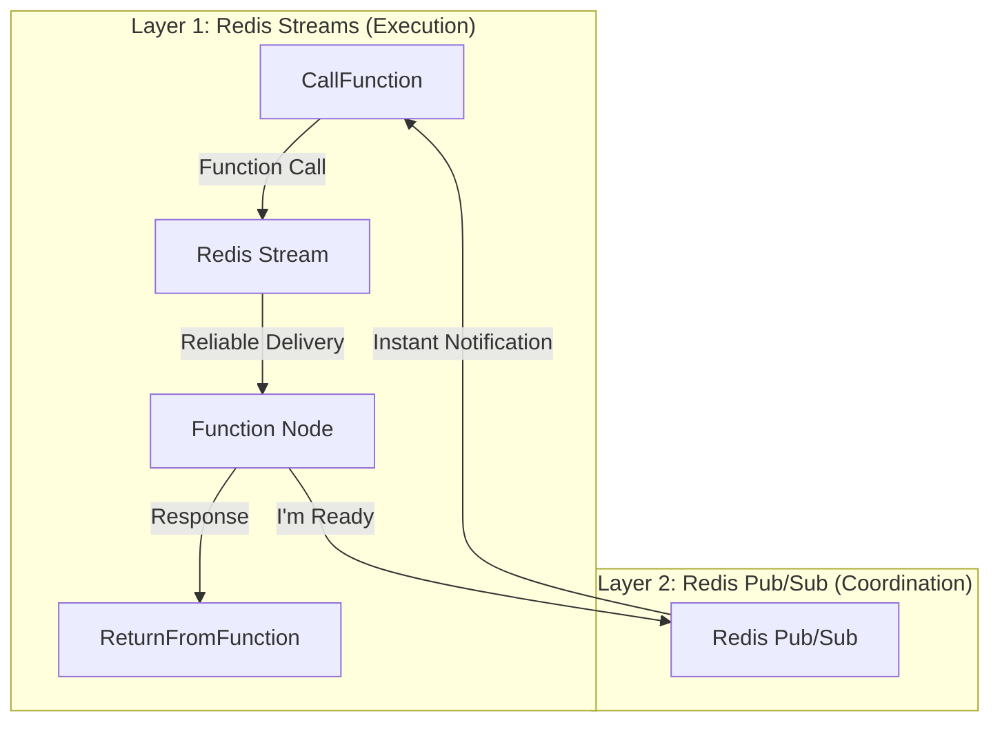

# Redis Pub/Sub Instant Readiness Implementation

## Overview

This document describes the implementation of Redis pub/sub notifications that eliminate the 4-6 second polling delays when CallFunction nodes wait for Function nodes to become ready. The system now provides **instant notifications** when functions come online.

## Architecture

### Hybrid Approach: Streams + Pub/Sub



- **Redis Streams**: Continue to handle reliable function execution (unchanged)
- **Redis Pub/Sub**: New layer for instant lifecycle notifications

## New Classes Implemented

### 1. **NotificationManager** (`nodes/NotificationManager.ts`)
- Manages Redis pub/sub connections
- Handles message routing and subscriptions
- Provides automatic reconnection

### 2. **FunctionLifecycleNotifier** (`nodes/FunctionLifecycleNotifier.ts`)
- Used by Function nodes to publish lifecycle events
- Publishes: ready, shutting down, offline, health status

### 3. **FunctionReadinessWatcher** (`nodes/FunctionReadinessWatcher.ts`)
- Used by CallFunction nodes to wait for readiness
- Subscribes to function ready notifications
- Provides instant notification when functions come online

### 4. **WorkerCoordinator** (`nodes/WorkerCoordinator.ts`)
- Orchestrates worker lifecycle with notifications
- Coordinates graceful shutdowns
- Bridges Function and CallFunction nodes

### 5. **EnhancedFunctionRegistry** (`nodes/EnhancedFunctionRegistry.ts`)
- Extends existing FunctionRegistry
- Adds instant readiness capabilities
- Maintains backward compatibility

## How It Works

### Function Node Startup
```typescript
// Function node registers and immediately publishes readiness
await registry.registerWorkerWithInstantNotification(workerId, functionName, workflowId)
// This publishes to: function:ready:${functionName}:${workflowId}
```

### CallFunction Instant Execution
```typescript
// CallFunction uses enhanced registry
const response = await enhancedRegistry.callFunctionWithInstantReadiness(
    functionName,
    workflowId,
    parameters,
    item,
    10000 // timeout
)
// This either executes immediately or waits for pub/sub notification
```

### Pub/Sub Channels

1. **Function Ready**: `function:ready:${functionName}:${workflowId}`
   - Published when Function node starts
   - CallFunction subscribes to get instant notification

2. **Function Shutdown**: `function:shutdown:${functionName}:${workflowId}`
   - Published before graceful shutdown
   - Allows CallFunction to avoid calls during restart

3. **Function Offline**: `function:offline:${functionName}:${workflowId}`
   - Published when Function node stops
   - Immediate notification of unavailability

4. **Worker Health**: `worker:health:${functionName}:${workflowId}`
   - Periodic health status updates
   - Instant failure detection

## Performance Improvements

### Before (Polling)
- 4-6 second delays during workflow saves
- CPU cycles wasted on polling
- Race conditions during restarts

### After (Pub/Sub)
- **0ms delay** - instant notifications
- No polling overhead
- Coordinated restarts

## Stability Improvements

### 1. **Graceful Shutdown Coordination**
```typescript
// Function node notifies before shutdown
await notifier.notifyShuttingDown(2000) // 2 second estimate
// CallFunction nodes immediately know to wait
```

### 2. **Instant Failure Detection**
```typescript
// Immediate notification when workers fail
await notifier.notifyUnhealthy('timeout')
// No waiting for next health check
```

### 3. **Prevention of Race Conditions**
- Function nodes notify readiness only after full initialization
- CallFunction nodes wait for explicit ready signal
- No more guessing about availability

## Backward Compatibility

The implementation maintains full backward compatibility:

1. **Fallback to Polling**: If pub/sub fails, system falls back to original polling
2. **Gradual Migration**: Can use original FunctionRegistry or EnhancedFunctionRegistry
3. **No Breaking Changes**: All existing APIs continue to work

## Configuration

No additional configuration required! The system automatically:
- Uses existing Redis connection
- Creates pub/sub clients as needed
- Manages subscriptions automatically

## Monitoring

### Diagnostic Logging

```
⚡ CallFunction: Using instant readiness check (no polling!)
📢 NOTIFICATIONS: Published to function:ready:Foo:workflow123
👀 WATCHER: Received ready notification for Foo
🚀 LIFECYCLE: Published ready notification for Foo
🎯 COORDINATOR: Worker ready instantly: worker-abc123
```

### Health Checks

The EnhancedFunctionRegistry provides instant status:
```typescript
const status = await registry.getInstantWorkerStatus(functionName, workflowId)
// Returns: { available, workers, healthyWorkers, isWaitingForWorker }
```

## Benefits Summary

### ⚡ **Instant Response Times**
- 0ms notification delay vs 4000ms polling
- Immediate function availability detection
- No wasted time during restarts

### 🛡️ **Enhanced Stability**
- Coordinated shutdowns prevent race conditions
- Instant failure detection and recovery
- Clean separation of execution and coordination

### 📈 **Better Resource Usage**
- No CPU cycles wasted on polling
- Efficient pub/sub message passing
- Minimal memory overhead

### 🔄 **Seamless Integration**
- Works with existing prevention-first approach
- Enhances rather than replaces current system
- Maintains all existing reliability guarantees

## Future Enhancements

1. **Pub/Sub for Circuit Breaker Coordination**
   - Share circuit breaker state across nodes
   - Instant failure propagation

2. **Workflow-Wide Notifications**
   - Notify all nodes when workflow saves
   - Coordinate complex multi-function workflows

3. **Performance Metrics via Pub/Sub**
   - Real-time performance monitoring
   - Instant bottleneck detection

## Conclusion

The Redis pub/sub implementation provides **instant function readiness** while maintaining the **bulletproof reliability** of Redis streams for actual execution. This hybrid approach gives us the best of both worlds: instant coordination with guaranteed delivery.