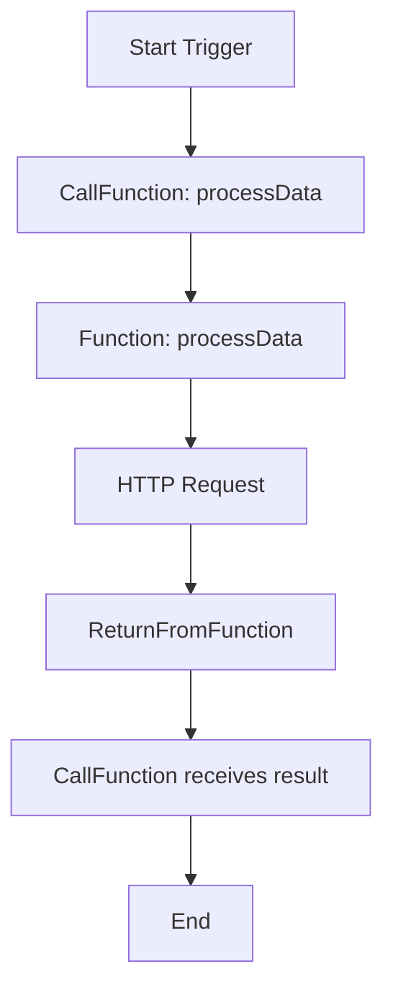
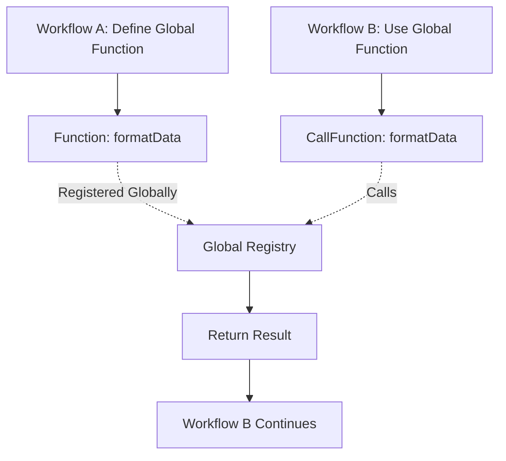
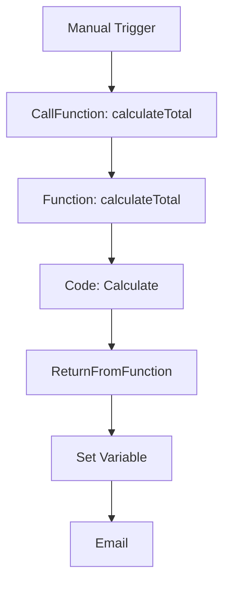
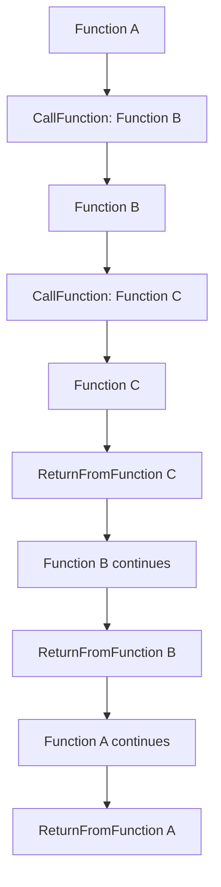

# 🧠 n8n-nodes-function

Blueprint-style function system for [n8n](https://n8n.io), inspired by Unreal Engine 5. Define reusable logic blocks with [`Function`](./nodes/Function), call them with [`CallFunction`](./nodes/CallFunction), and return values with [`ReturnFromFunction`](./nodes/ReturnFromFunction).

## 📦 Features

- 🧱 **Define reusable logic** with named [`Function`](./nodes/Function/Function.node.ts) nodes
- 📞 **Call functions** with dynamic parameters using [`CallFunction`](./nodes/CallFunction/CallFunction.node.ts)
- 🔁 **Return values cleanly** using [`ReturnFromFunction`](./nodes/ReturnFromFunction/ReturnFromFunction.node.ts)
- 🧬 **Nested function calls** - functions can call other functions with isolated return values
- 🌍 **Global functions** - share logic across workflows
- 🧼 **Clean data flow** - no internal metadata in `item.json`
- ⚡ **Smart parameter merging** - parameters always available downstream
- 🎯 **Composable workflows** with function-style abstraction
- 🔒 **Safe code execution** using n8n's built-in sandboxing

---

## 🚀 Quick Start

### Installation

```bash
# Clone the repository
git clone https://github.com/mrowrpurr/n8n-nodes-function.git
cd n8n-nodes-function

# Install dependencies
pnpm install

# Build the nodes
pnpm build
```

### Load into n8n

1. Copy the built nodes to your n8n custom nodes directory
2. Restart n8n
3. The new nodes will appear in the node palette under "Transform"

---

## 🧩 Node Overview

### 🧱 Function Node

Defines a named, reusable function with parameters that can be called from within your workflow or globally across all workflows.

**Key Features:**
- **Global Function toggle** - enable cross-workflow function sharing
- Named function definition
- Parameter specification with types and defaults
- Optional inline JavaScript execution
- **Smart parameter injection** - parameters are always included in output

**Function Scope:**
- 🏠 **Local Functions** (default): Available only within the current workflow
- 🌍 **Global Functions**: Available across all workflows in your n8n instance

**Parameter Behavior:**
- ✅ **Always available**: Parameters are injected into the output item
- ✅ **Code disabled**: Parameters become the output data
- ✅ **Code enabled**: Parameters merge with returned values

```javascript
// Example: Parameters { text: "hello", count: 5 }
// With this code:
console.log("Processing:", text);
return {
  text: "world",     // Overrides parameter
  processed: true    // New field
};
// Result: { text: "world", count: 5, processed: true }
```


*📸 Screenshot placeholder: Function node configuration*

---

### 📞 CallFunction Node

Invokes a defined function with parameters and optionally stores the return value. Can call local functions within the current workflow or global functions from any workflow.

**Key Features:**
- **Global Function toggle** - call functions from any workflow
- Dynamic function selection (filtered by scope)
- Parameter passing (individual or JSON)
- Optional return value storage
- Clean error handling

**Function Scope:**
- 🏠 **Local Functions** (default): Only shows functions from current workflow
- 🌍 **Global Functions**: Only shows globally registered functions

**Parameter Modes:**
- **Individual Parameters**: Configure each parameter separately
- **JSON Object**: Pass all parameters as a single JSON object

**Return Value Storage:**
- Toggle "Store Response" to capture ReturnFromFunction values
- Specify variable name to store the response


*📸 Screenshot placeholder: CallFunction node with parameters*

---

### 🔁 ReturnFromFunction Node

Explicitly returns a value from within a function execution context.

**Key Features:**
- JSON return value specification
- Automatic execution context detection
- Clean registry-based value passing

```json
{
  "result": "Function completed successfully",
  "data": { "processed": true },
  "timestamp": "2024-01-01T00:00:00.000Z"
}
```


*📸 Screenshot placeholder: ReturnFromFunction node with return value*

---

## 🎯 Parameter Merging Behavior

### When Code is Disabled
```yaml
Function Parameters: { name: "John", age: 30 }
Code Execution: false
Output: { name: "John", age: 30 }
```

### When Code Returns Nothing
```javascript
// Parameters: { name: "John", age: 30 }
console.log("Hello", name);
// No return statement
// Output: { name: "John", age: 30 }
```

### When Code Returns an Object
```javascript
// Parameters: { name: "John", age: 30 }
return { 
  name: "Jane",        // Overrides parameter
  processed: true      // New field
};
// Output: { name: "Jane", age: 30, processed: true }
```

### When Code Returns a Primitive
```javascript
// Parameters: { name: "John", age: 30 }
return "success";
// Output: { name: "John", age: 30, result: "success" }
```

---

## 🧪 Example Workflows

### Basic Local Function Call




*📸 Screenshot placeholder: Basic function call workflow*

### Global Function Across Workflows




*📸 Screenshot placeholder: Global function across workflows*

### Advanced: Function with Parameters




*📸 Screenshot placeholder: Advanced workflow with parameters*

---

## 🛠️ Configuration Examples

### Local Function Node Configuration

```yaml
Global Function: false
Function Name: calculateTotal
Parameters:
  - name: items
    type: array
    required: true
    description: "Array of items to calculate total for"
  - name: taxRate
    type: number
    required: false
    defaultValue: "0.08"
    description: "Tax rate as decimal"

Enable Code Execution: true
Code: |
  // Parameters 'items' and 'taxRate' are automatically available
  const subtotal = items.reduce((sum, item) => sum + item.price, 0);
  const tax = subtotal * taxRate;
  
  return {
    subtotal: subtotal,
    tax: tax,
    total: subtotal + tax,
    itemCount: items.length
  };
  // Result includes all parameters plus returned fields
```

### Global Function Node Configuration

```yaml
Global Function: true
Function Name: formatUserData
Parameters:
  - name: userData
    type: object
    required: true
    description: "Raw user data to format"
  - name: includeMetadata
    type: boolean
    required: false
    defaultValue: "true"
    description: "Whether to include metadata fields"

Enable Code Execution: true
Code: |
  // This function is available across all workflows
  const formatted = {
    id: userData.id,
    name: userData.fullName || `${userData.firstName} ${userData.lastName}`,
    email: userData.email.toLowerCase(),
    active: userData.status === 'active'
  };
  
  if (includeMetadata) {
    formatted.metadata = {
      lastLogin: userData.lastLogin,
      createdAt: userData.createdAt
    };
  }
  
  return formatted;
```

### Local CallFunction Node Configuration

```yaml
Global Function: false
Function Name: calculateTotal
Parameter Mode: Individual Parameters
Parameters:
  - name: items
    value: "{{ $json.orderItems }}"
  - name: taxRate
    value: "0.10"

Store Response: true
Response Variable Name: "calculationResult"
```

### Global CallFunction Node Configuration

```yaml
Global Function: true
Function Name: formatUserData
Parameter Mode: Individual Parameters
Parameters:
  - name: userData
    value: "{{ $json.user }}"
  - name: includeMetadata
    value: "false"

Store Response: true
Response Variable Name: "formattedUser"
```

### ReturnFromFunction Node Configuration

```yaml
Return Value: |
  {
    "status": "completed",
    "processedAt": "{{ new Date().toISOString() }}",
    "result": {{ $json.total }}
  }
```

---

## 🔧 Advanced Usage

### Nested Function Calls

Functions can call other functions, creating powerful composition patterns:

- ✅ **Isolated return values**: Each function call gets its own unique execution context
- ✅ **Call context stack**: Internal stack ensures proper return value routing
- ✅ **Automatic waiting**: System waits for `ReturnFromFunction` to execute before completing calls
- ✅ **Deep nesting**: Supports arbitrary levels of function call nesting



### Dynamic Parameter Validation

The system automatically validates parameters against the function signature:

- ✅ **Required parameters** must be provided
- ✅ **Type checking** for string, number, boolean, array, object
- ✅ **Default values** are applied when parameters are missing
- ✅ **Invalid parameters** are filtered out with warnings

### Execution Context

Functions are isolated by execution context using a call context stack:

- **Local functions**: Scoped to the current workflow execution
- **Global functions**: Available across all workflows and executions
- **Call context stack**: Each function call gets a unique ID (`__active___call_1`, `__active___call_2`, etc.)
- **Return value isolation**: Return values are tracked per unique call context
- **Clean separation**: No conflicts between concurrent or nested executions
- **Automatic cleanup**: Stack is managed automatically as functions complete

### Parameter Conflict Resolution

When code returns an object, conflicts are resolved as follows:

1. **Parameters are merged first** (always available)
2. **Returned object values override** parameters with same keys
3. **New fields from returned object** are added
4. **Parameters not in returned object** are preserved

```javascript
// Parameters: { id: 1, name: "test", status: "pending" }
return { name: "updated", category: "new" };
// Final output: { id: 1, name: "updated", status: "pending", category: "new" }
```

---

## 🌍 Global Functions

### Overview

Global functions allow you to create reusable logic that can be called from any workflow in your n8n instance. This is perfect for:

- **Utility functions** (formatting, validation, calculations)
- **Common business logic** shared across multiple workflows
- **Centralized data processing** functions

### How Global Functions Work

1. **Registration**: When a Function node with "Global Function" enabled is executed, it registers itself in the global scope
2. **Discovery**: CallFunction nodes with "Global Function" enabled only see globally registered functions
3. **Execution**: Global functions work identically to local functions but are accessible cross-workflow
4. **Return Values**: ReturnFromFunction works seamlessly with global functions

### Best Practices

- **Naming Convention**: Use descriptive names like `formatUserData` or `calculateTax`
- **Documentation**: Always provide clear parameter descriptions
- **Version Control**: Consider using version numbers in function names for breaking changes
- **Error Handling**: Include robust error handling in global functions since they're used across workflows

### Example Use Cases

```javascript
// Global utility function for data formatting
// Function Name: formatCurrency
return {
  formatted: new Intl.NumberFormat('en-US', {
    style: 'currency',
    currency: currency || 'USD'
  }).format(amount),
  raw: amount
};
```

```javascript
// Global validation function
// Function Name: validateEmail
const emailRegex = /^[^\s@]+@[^\s@]+\.[^\s@]+$/;
return {
  isValid: emailRegex.test(email),
  normalized: email.toLowerCase().trim()
};
```

---

## 🧰 Development

### Prerequisites

- Node.js 18+
- pnpm package manager
- n8n development environment

### Development Setup

```bash
# Install dependencies
pnpm install

# Start development build
pnpm dev

# Run tests (if available)
pnpm test

# Build for production
pnpm build
```

### Project Structure

```
n8n-nodes-function/
├── nodes/
│   ├── Function/
│   │   ├── Function.node.ts
│   │   └── function.svg
│   ├── CallFunction/
│   │   ├── CallFunction.node.ts
│   │   └── callFunction.svg
│   ├── ReturnFromFunction/
│   │   ├── ReturnFromFunction.node.ts
│   │   └── returnFromFunction.svg
│   └── FunctionRegistry.ts
├── package.json
├── tsconfig.json
└── gulpfile.js
```

---

## 📚 API Reference

### FunctionRegistry

The central registry managing function definitions, return values, and call context stack.

#### Methods

- [`registerFunction(name, executionId, nodeId, params, callback)`](./nodes/FunctionRegistry.ts:34) - Register a function
- [`callFunction(name, executionId, params, item)`](./nodes/FunctionRegistry.ts:60) - Call a registered function (returns `{ result, actualExecutionId }`)
- [`setFunctionReturnValue(executionId, value)`](./nodes/FunctionRegistry.ts:133) - Store return value
- [`getFunctionReturnValue(executionId)`](./nodes/FunctionRegistry.ts:138) - Retrieve return value
- [`getAvailableFunctions(executionId?)`](./nodes/FunctionRegistry.ts:87) - List available functions
- [`getFunctionParameters(functionName, executionId?)`](./nodes/FunctionRegistry.ts:106) - Get function parameters
- [`getCurrentCallContext()`](./nodes/FunctionRegistry.ts:203) - Get current call context from stack
- [`pushCurrentFunctionExecution(executionId)`](./nodes/FunctionRegistry.ts:149) - Push execution context to stack
- [`popCurrentFunctionExecution()`](./nodes/FunctionRegistry.ts:157) - Pop execution context from stack

#### Example Usage

```typescript
const registry = FunctionRegistry.getInstance();

// Register a function
registry.registerFunction('myFunc', 'exec-123', 'node-456', paramDefs, async (params, item) => {
  return [{ json: { result: 'success', ...params }, index: 0 }];
});

// Call the function (returns both result and actual execution ID used)
const { result, actualExecutionId } = await registry.callFunction('myFunc', 'exec-123', { input: 'test' }, item);

// Get current call context (for nested calls)
const currentContext = registry.getCurrentCallContext();
```

---

## 🧪 Testing

### Manual Testing

1. Create a workflow with a Function node
2. Add parameters and optional code
3. Add a CallFunction node pointing to your function
4. Configure parameters
5. Add ReturnFromFunction if you need return values
6. Execute and verify behavior

### Test Scenarios

- ✅ Function with no parameters
- ✅ Function with required parameters
- ✅ Function with optional parameters and defaults
- ✅ Function with inline code execution
- ✅ Function returning complex JSON objects
- ✅ Parameter merging with returned objects
- ✅ Multiple function calls in same workflow
- ✅ Error handling for missing functions
- ✅ Parameter validation and type conversion

---

## ⚠️ Gotchas & Notes

### Workflow Activation Requirements

Functions only work when their containing workflow is **Active**:

- 🔴 **Inactive workflows**: Functions are not registered and cannot be called
- 🟢 **Active workflows**: Functions are registered in the global registry
- 🔄 **Registry updates**: Toggle Active OFF/ON to refresh function registrations after changes

#### Why This Happens
This is a limitation of how n8n works. Function nodes use the trigger mechanism to register themselves, which only occurs when workflows are activated. This is not a bug but a necessary workaround within n8n's architecture.

```bash
# To update function definitions:
1. Make changes to Function node
2. Toggle workflow Active OFF
3. Toggle workflow Active ON
4. Functions are now updated in registry
```

### Function Executions Show as Separate Runs

Each function call creates its own execution entry in n8n's execution history:

**Pros:**
- ✅ **Individual debugging**: Each function call can be inspected separately
- ✅ **Clear execution flow**: Easy to trace which functions were called and when
- ✅ **Isolated logging**: Function-specific logs don't clutter main workflow logs
- ✅ **Performance monitoring**: Track execution time per function

**Cons:**
- ❌ **Execution count inflation**: More entries in execution history
- ❌ **Visual noise**: Multiple executions for what feels like a single workflow run
- ❌ **Billing implications**: If using n8n Cloud with execution limits, each function call counts

#### Example Execution Flow
```
Main Workflow Execution #123
├── Function A Execution #124
│   ├── Function B Execution #125
│   └── Function C Execution #126
└── Continues with result...
```

### Memory and Performance Considerations

**Function Registry:**
- Registry persists in memory for the lifetime of the n8n process
- Global functions remain registered until n8n restarts
- Local functions are cleaned up when workflows are deactivated

**Return Value Storage:**
- Return values are temporarily stored in memory
- Automatic cleanup occurs after retrieval
- Large return values may impact memory usage

### Development Workflow Recommendations

1. **Start Simple**: Begin with local functions before using global ones
2. **Test Incrementally**: Use manual triggers to test function calls
3. **Monitor Executions**: Watch execution history during development
4. **Clear Testing**: Deactivate/reactivate workflows to ensure clean state
5. **Version Global Functions**: Use descriptive names for global functions to avoid conflicts

### Architecture Limitations We Work With

These behaviors stem from working within n8n's existing architecture:

- **Trigger System**: Function registration uses n8n's trigger mechanism
- **Execution Model**: Each function call must be a separate execution for proper isolation
- **Registry Design**: Global state management is necessary for cross-workflow functionality
- **Return Value Handling**: Asynchronous return value capture requires polling/waiting

---

## 🐛 Troubleshooting

### Common Issues

#### "Function not found" Error
- Ensure the Function node has executed before CallFunction
- Check that function names match exactly
- Verify the execution context is correct

#### "Could not get parameter" Error
- Check that all required parameters are configured
- Ensure parameter names match the function definition
- Verify parameter values are valid JSON when using JSON mode

#### "Invalid JSON in parameters" Error
- Validate JSON syntax in parameter values
- Use the JSON parameter mode for complex objects
- Check for proper escaping of quotes and special characters

#### Schema 404 Warning
```
GET http://localhost:5678/schemas/CUSTOM.function/1.0.0.json 404 (Not Found)
```
This is harmless - n8n tries to load a JSON schema for validation but falls back to the node's internal properties definition when not found.

#### Parameters Not Available
- Parameters are automatically injected into the output item
- Check that your Function node has the latest version
- Verify that parameter names don't conflict with built-in properties

---

## 📸 Screenshots

To add screenshots for better documentation:

1. Create a `docs/screenshots/` directory
2. Add screenshots for each node configuration
3. Include workflow examples
4. Update the image paths in this README

### Planned Screenshots

- [ ] `docs/screenshots/function-node.png` - Function node configuration
- [ ] `docs/screenshots/callfunction-node.png` - CallFunction with parameters
- [ ] `docs/screenshots/returnfromfunction-node.png` - ReturnFromFunction with return value
- [ ] `docs/screenshots/basic-workflow.png` - Simple function call workflow
- [ ] `docs/screenshots/advanced-workflow.png` - Complex workflow with parameters
- [ ] `docs/screenshots/parameter-merging.png` - Parameter merging examples
- [ ] `docs/screenshots/error-handling.png` - Error message examples

---

## 🆕 What's New

### Latest Version Features

- 🧬 **Nested Function Calls**: Functions can now call other functions with perfect isolation
- 🔄 **Call Context Stack**: Advanced execution context management for nested calls
- ⏱️ **Automatic Return Value Waiting**: System now waits for `ReturnFromFunction` to complete
- 🎯 **Unique Call IDs**: Each function invocation gets its own execution context
- 🌍 **Global Functions**: Share functions across workflows with a simple toggle
- ✅ **Smart Parameter Injection**: Parameters are always available in the output item
- ✅ **Intelligent Merging**: Returned objects merge with parameters (returned keys win)
- ✅ **Clean Data Flow**: No internal metadata pollution in `item.json`
- ✅ **Improved Error Handling**: Better validation and error messages
- ✅ **Execution Context Isolation**: Clean separation between concurrent executions
- ✅ **Scoped Function Discovery**: Dropdown filters functions by local/global scope

---

## 🤝 Contributing

1. Fork the repository
2. Create a feature branch
3. Make your changes
4. Add tests if applicable
5. Submit a pull request

---

## 📄 License

This project is licensed under the MIT License - see the [LICENSE](LICENSE) file for details.

---

## 🙏 Acknowledgments

- Inspired by Unreal Engine 5's Blueprint system
- Built for the amazing [n8n](https://n8n.io) automation platform
- Thanks to the n8n community for feedback and suggestions

---

## 📞 Support

- 📧 **Issues**: [GitHub Issues](https://github.com/mrowrpurr/n8n-nodes-function/issues)
- 💬 **Discussions**: [GitHub Discussions](https://github.com/mrowrpurr/n8n-nodes-function/discussions)
- 📖 **n8n Docs**: [n8n Documentation](https://docs.n8n.io)
