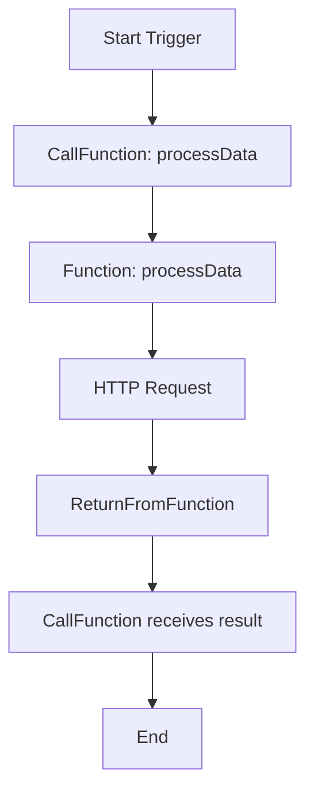
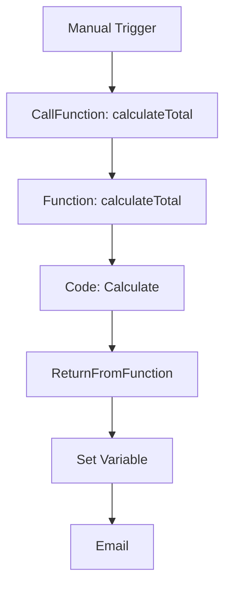

# 🧠 n8n-nodes-function

Blueprint-style function system for [n8n](https://n8n.io), inspired by Unreal Engine 5. Define reusable logic blocks with [`Function`](./nodes/Function), call them with [`CallFunction`](./nodes/CallFunction), and return values with [`ReturnFromFunction`](./nodes/ReturnFromFunction).

[](https://n8n.io)
[](https://www.typescriptlang.org/)

---

## 📦 Features

- 🧱 **Define reusable logic** with named [`Function`](./nodes/Function/Function.node.ts) nodes
- 📞 **Call functions** with dynamic parameters using [`CallFunction`](./nodes/CallFunction/CallFunction.node.ts)
- 🔁 **Return values cleanly** using [`ReturnFromFunction`](./nodes/ReturnFromFunction/ReturnFromFunction.node.ts)
- 🧼 **Clean data flow** - no internal metadata in `item.json`
- ⚡ **Optional inline JavaScript** execution for side effects
- 🎯 **Composable workflows** with function-style abstraction

---

## 🚀 Quick Start

### Installation

```bash
# Clone the repository
git clone https://github.com/mrowrpurr/n8n-nodes-function.git
cd n8n-nodes-function

# Install dependencies
pnpm install

# Build the nodes
pnpm build
```

### Load into n8n

1. Copy the built nodes to your n8n custom nodes directory
2. Restart n8n
3. The new nodes will appear in the node palette under "Transform"

---

## 🧩 Node Overview

### 🧱 Function Node

Defines a named, reusable function with parameters that can be called from anywhere in your workflow.

**Key Features:**
- Named function definition
- Parameter specification with types and defaults
- Optional inline JavaScript execution
- Clean item passthrough

```javascript
// Example inline code (optional)
item.processed = true;
item.timestamp = new Date().toISOString();
```


*📸 Screenshot placeholder: Function node configuration*

---

### 📞 CallFunction Node

Invokes a defined function with parameters and optionally stores the return value.

**Key Features:**
- Dynamic function selection
- Parameter passing (individual or JSON)
- Optional return value storage
- Clean error handling

**Parameter Modes:**
- **Individual Parameters**: Configure each parameter separately
- **JSON Object**: Pass all parameters as a single JSON object


*📸 Screenshot placeholder: CallFunction node with parameters*

---

### 🔁 ReturnFromFunction Node

Explicitly returns a value from within a function execution context.

**Key Features:**
- JSON return value specification
- Automatic execution context detection
- Clean registry-based value passing

```json
{
  "result": "Function completed successfully",
  "data": { "processed": true },
  "timestamp": "2024-01-01T00:00:00.000Z"
}
```


*📸 Screenshot placeholder: ReturnFromFunction node with return value*

---

## 🧪 Example Workflows

### Basic Function Call




*📸 Screenshot placeholder: Basic function call workflow*

### Advanced: Function with Parameters




*📸 Screenshot placeholder: Advanced workflow with parameters*

---

## 🛠️ Configuration Examples

### Function Node Configuration

```yaml
Function Name: calculateTotal
Parameters:
  - name: items
    type: array
    required: true
    description: "Array of items to calculate total for"
  - name: taxRate
    type: number
    required: false
    defaultValue: "0.08"
    description: "Tax rate as decimal"

Enable Code Execution: true
Code: |
  // Optional side effects
  item.calculationStarted = new Date().toISOString();
  console.log(`Calculating total for ${item.json.items.length} items`);
```

### CallFunction Node Configuration

```yaml
Function Name: calculateTotal
Parameter Mode: Individual Parameters
Parameters:
  - name: items
    value: "{{ $json.orderItems }}"
  - name: taxRate
    value: "0.10"

Store Response: true
Response Variable Name: "totalResult"
```

### ReturnFromFunction Node Configuration

```yaml
Return Value: |
  {
    "subtotal": {{ $json.subtotal }},
    "tax": {{ $json.tax }},
    "total": {{ $json.total }},
    "itemCount": {{ $json.items.length }}
  }
```

---

## 🔧 Advanced Usage

### Dynamic Parameter Validation

The system automatically validates parameters against the function signature:

- ✅ **Required parameters** must be provided
- ✅ **Type checking** for string, number, boolean, array, object
- ✅ **Default values** are applied when parameters are missing
- ✅ **Invalid parameters** are filtered out with warnings

### Execution Context

Functions are isolated by execution context:

- Each workflow execution gets its own function registry
- Return values are tracked per execution
- Clean separation between concurrent executions
- No cross-execution data leakage

### Error Handling

Robust error handling at every level:

- **Function not found**: Clear error message with available functions
- **Parameter validation**: Detailed parameter mismatch information
- **JSON parsing**: Helpful syntax error messages
- **Execution errors**: Full stack traces with context

---

## 🧰 Development

### Prerequisites

- Node.js 18+
- pnpm package manager
- n8n development environment

### Development Setup

```bash
# Install dependencies
pnpm install

# Start development build
pnpm dev

# Run tests (if available)
pnpm test

# Build for production
pnpm build
```

### Project Structure

```
n8n-nodes-function/
├── nodes/
│   ├── Function/
│   │   ├── Function.node.ts
│   │   └── function.svg
│   ├── CallFunction/
│   │   ├── CallFunction.node.ts
│   │   └── callFunction.svg
│   ├── ReturnFromFunction/
│   │   ├── ReturnFromFunction.node.ts
│   │   └── returnFromFunction.svg
│   └── FunctionRegistry.ts
├── package.json
├── tsconfig.json
└── gulpfile.js
```

---

## 📚 API Reference

### FunctionRegistry

The central registry managing function definitions and return values.

#### Methods

- [`registerFunction(name, executionId, callback)`](./nodes/FunctionRegistry.ts:30) - Register a function
- [`callFunction(name, executionId, params, item)`](./nodes/FunctionRegistry.ts:45) - Call a registered function
- [`setFunctionReturnValue(executionId, value)`](./nodes/FunctionRegistry.ts:75) - Store return value
- [`getFunctionReturnValue(executionId)`](./nodes/FunctionRegistry.ts:80) - Retrieve return value
- [`getAvailableFunctions()`](./nodes/FunctionRegistry.ts:65) - List available functions
- [`getFunctionParameters(functionName)`](./nodes/FunctionRegistry.ts:70) - Get function parameters

#### Example Usage

```typescript
const registry = FunctionRegistry.getInstance();

// Register a function
registry.registerFunction('myFunc', 'exec-123', async (params, item) => {
  return { result: 'success' };
});

// Call the function
const result = await registry.callFunction('myFunc', 'exec-123', { input: 'test' }, item);
```

---

## 🧪 Testing

### Manual Testing

1. Create a workflow with a Function node
2. Add parameters and optional code
3. Add a CallFunction node pointing to your function
4. Configure parameters
5. Add ReturnFromFunction if you need return values
6. Execute and verify behavior

### Test Scenarios

- ✅ Function with no parameters
- ✅ Function with required parameters
- ✅ Function with optional parameters and defaults
- ✅ Function with inline code execution
- ✅ Function returning complex JSON objects
- ✅ Multiple function calls in same workflow
- ✅ Error handling for missing functions
- ✅ Parameter validation and type conversion

---

## 🐛 Troubleshooting

### Common Issues

#### "Function not found" Error
- Ensure the Function node has executed before CallFunction
- Check that function names match exactly
- Verify the execution context is correct

#### "Could not get parameter" Error
- Check that all required parameters are configured
- Ensure parameter names match the function definition
- Verify parameter values are valid JSON when using JSON mode

#### "Invalid JSON in parameters" Error
- Validate JSON syntax in parameter values
- Use the JSON parameter mode for complex objects
- Check for proper escaping of quotes and special characters

---

## 📸 Screenshots

To add screenshots for better documentation:

1. Create a `docs/screenshots/` directory
2. Add screenshots for each node configuration
3. Include workflow examples
4. Update the image paths in this README

### Planned Screenshots

- [ ] `docs/screenshots/function-node.png` - Function node configuration
- [ ] `docs/screenshots/callfunction-node.png` - CallFunction with parameters
- [ ] `docs/screenshots/returnfromfunction-node.png` - ReturnFromFunction with return value
- [ ] `docs/screenshots/basic-workflow.png` - Simple function call workflow
- [ ] `docs/screenshots/advanced-workflow.png` - Complex workflow with parameters
- [ ] `docs/screenshots/parameter-validation.png` - Parameter validation in action
- [ ] `docs/screenshots/error-handling.png` - Error message examples

---

## 🤝 Contributing

1. Fork the repository
2. Create a feature branch
3. Make your changes
4. Add tests if applicable
5. Submit a pull request

---

## 📄 License

This project is licensed under the MIT License - see the [LICENSE](LICENSE) file for details.

---

## 🙏 Acknowledgments

- Inspired by Unreal Engine 5's Blueprint system
- Built for the amazing [n8n](https://n8n.io) automation platform
- Thanks to the n8n community for feedback and suggestions

---

## 📞 Support

- 📧 **Issues**: [GitHub Issues](https://github.com/mrowrpurr/n8n-nodes-function/issues)
- 💬 **Discussions**: [GitHub Discussions](https://github.com/mrowrpurr/n8n-nodes-function/discussions)
- 📖 **n8n Docs**: [n8n Documentation](https://docs.n8n.io)
