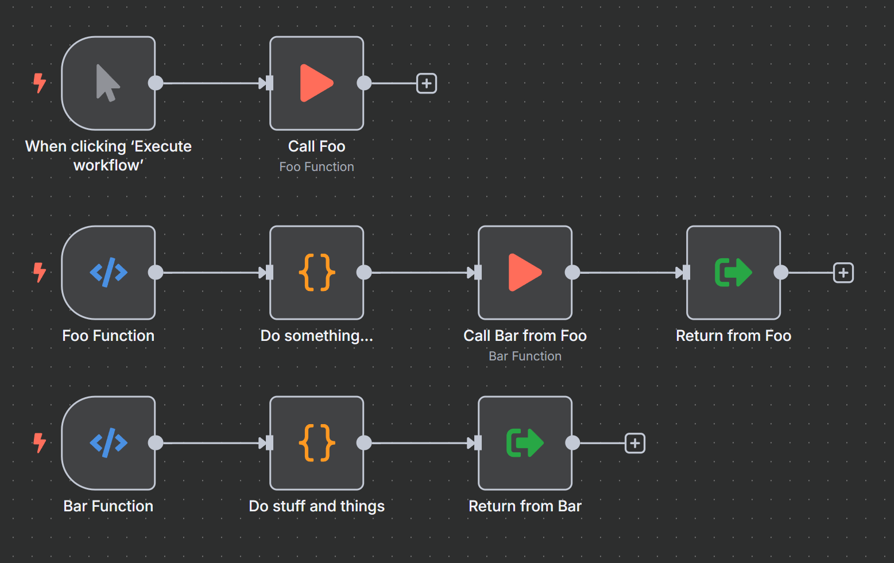
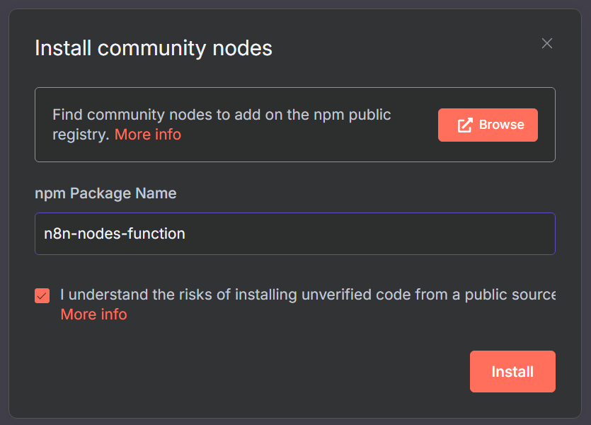
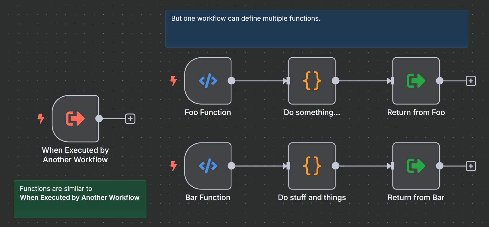
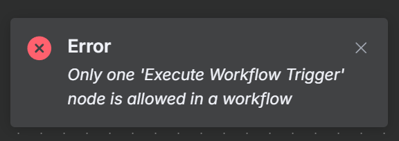
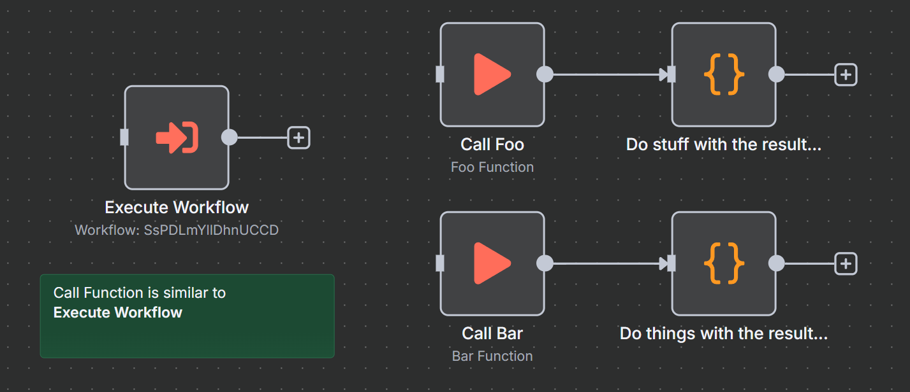

> 🚧 Beta Testing 🚧

# 🧠 n8n-nodes-function <!-- omit from toc -->

- [📦 Features](#-features)
- [🛠️ Installation](#️-installation)
- [ℹ️ Notes](#ℹ️-notes)
- [🔎 Similarities to n8n's `Execute Workflow`](#-similarities-to-n8ns-execute-workflow)
  - [⚡ `Function` trigger (_similar to `When Executed by Another Workflow`_)](#-function-trigger-similar-to-when-executed-by-another-workflow)
  - [➡️ `Call Function` (_similar to `Execute Workflow`_)](#️-call-function-similar-to-execute-workflow)
- [🎓 Getting Started](#-getting-started)

Blueprint-style function system for [n8n](https://n8n.io), inspired by Unreal Engine 5.

Define reusable logic blocks with `Function`, call them with `Call Function`, and return values with `Return From Function`.

## 📦 Features

- 🧱 **Define reusable logic** with named [`Function`](./nodes/Function/Function.node.ts) nodes
- 📞 **Call functions** with dynamic parameters using [`CallFunction`](./nodes/CallFunction/CallFunction.node.ts)
- 🔁 **Return values cleanly** using [`ReturnFromFunction`](./nodes/ReturnFromFunction/ReturnFromFunction.node.ts)
- 🧬 **Nested function calls** - functions can call other functions with isolated return values
- 🌍 **Global functions** - share logic across workflows

## 🛠️ Installation

## ℹ️ Notes

> 👋 Hey `n8n` team devs, feel free to take these ideas and build this into `n8n` 😉 `<3`

- 🟢 Functions only work on `Active` workflows.

- 🔃 To detect changes to new/existing `Function` nodes, toggle the workflow off/on.
  > _The `Call Function` and `Return from Function` do not require toggle workflow after changes._  
  > _But function names/params from `Function` nodes require toggling the active state._  
  > _It's not an intentional choice, it's just a limitation of how trigger nodes work in `n8n`._

- ▶️ Functions appear as separate `Executions`.
  > _Again, this is not an intentional choice, it's just how `n8n` works with trigger nodes._
  
- Both standard and [queue mode](https://docs.n8n.io/hosting/scaling/queue-mode/) are supported
  > _In queue mode, Redis streaming is used._

## 🔎 Similarities to n8n's `Execute Workflow`

Functions are a way of organizing reusable logic in `n8n`, similar to the `Execute Workflow` node.

They allow you to define a set of operations that can be called with parameters, and return values cleanly.

The main difference is that `Execute Workflow` encapsulates an entire workflow, while `Function` nodes can live alongside other nodes in the same workflow.

It's just a different level of abstraction and a different way of organizing logic.

> _Note: behind the scenes, the implementation may be quite different, but at a high-level of how to organize your workflow logic, they are similar._

### ⚡ `Function` trigger (_similar to `When Executed by Another Workflow`_)

> One limitation of the `When Executed by Another Workflow` node is that it can only be used once in a workflow.
>
> 
>
> Whereas `Function` nodes can be used multiple times in a workflow, allowing for a different way of organizing reusable code.

### ➡️ `Call Function` (_similar to `Execute Workflow`_)

## 🎓 Getting Started

...
similar to `Execute Workflow`