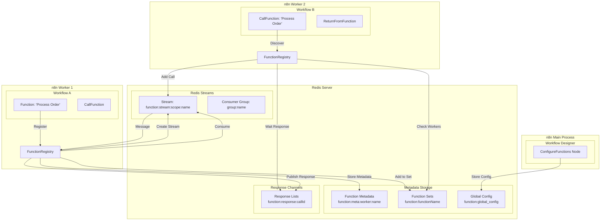
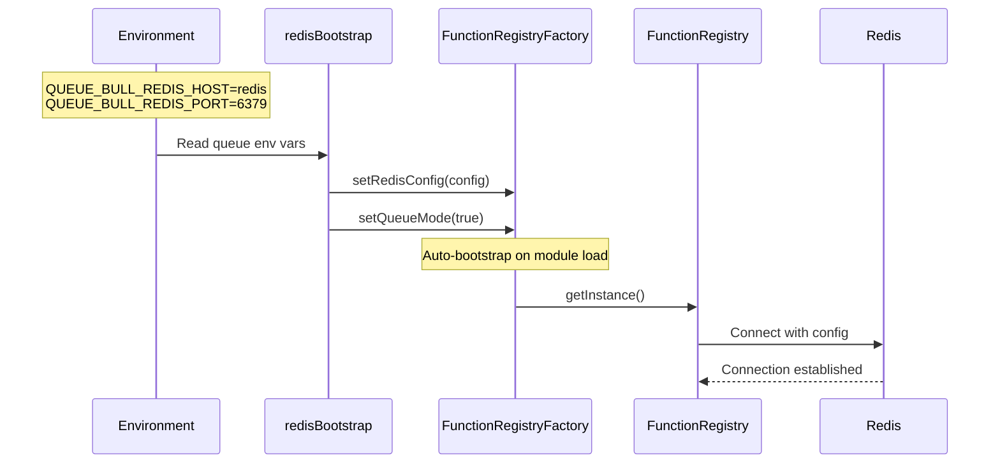
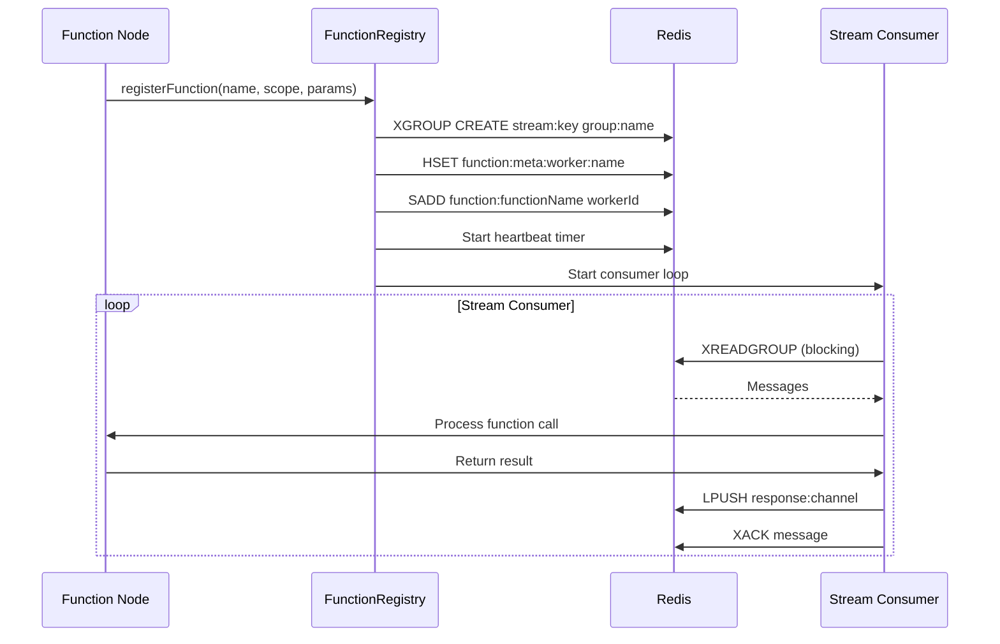
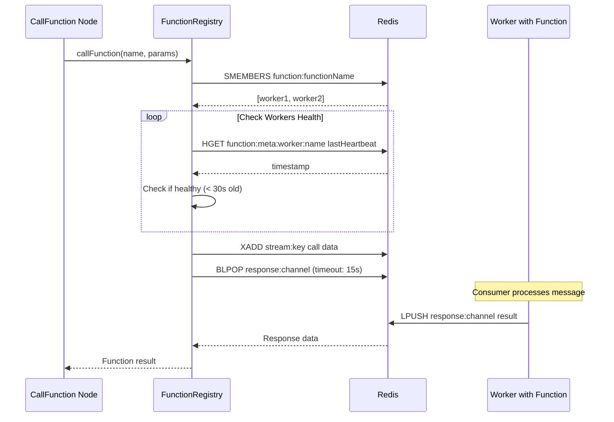
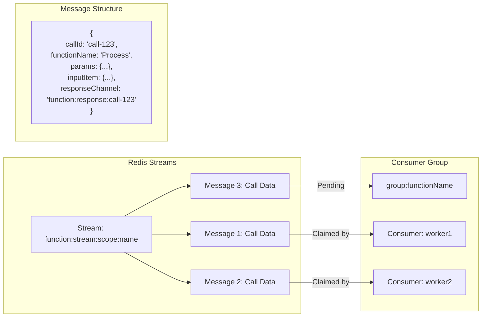
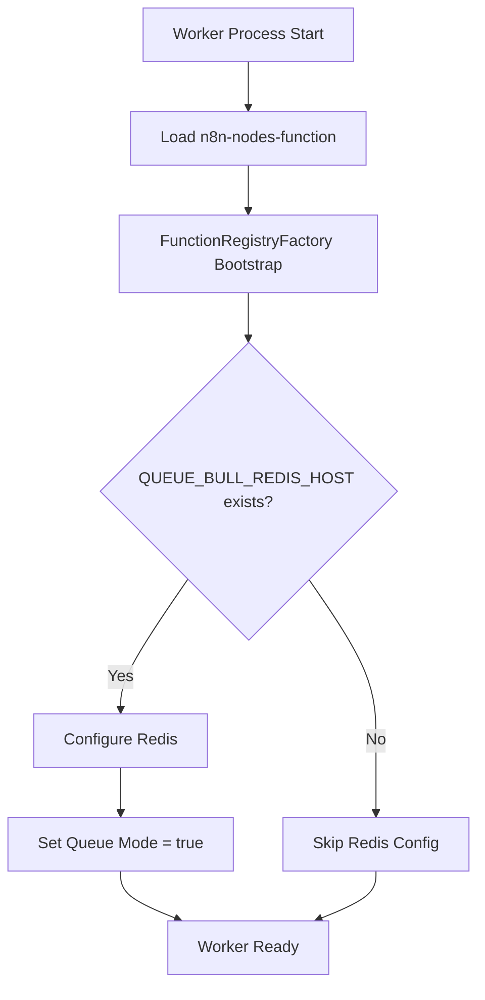
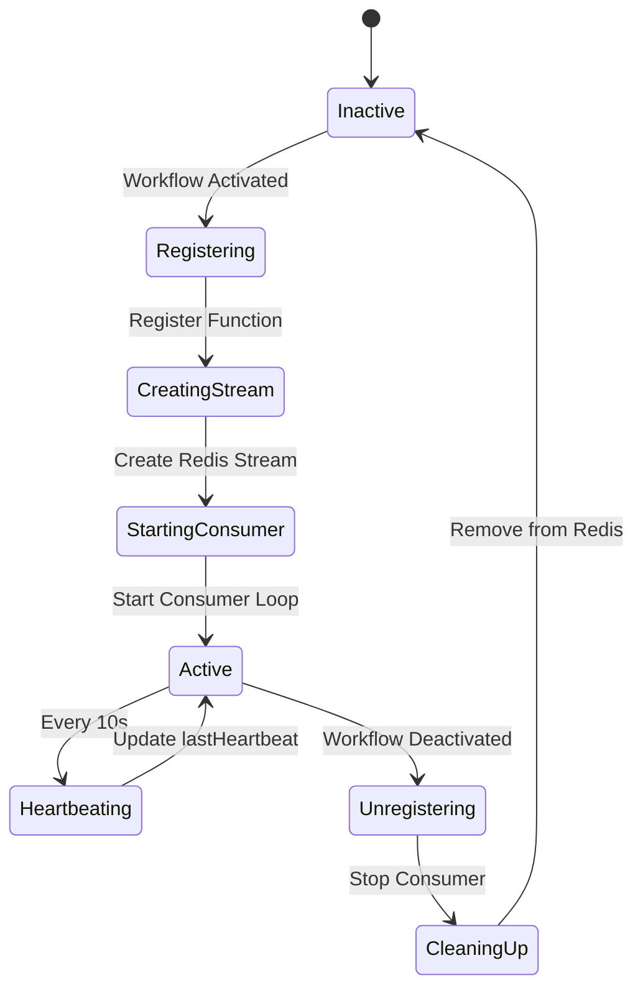
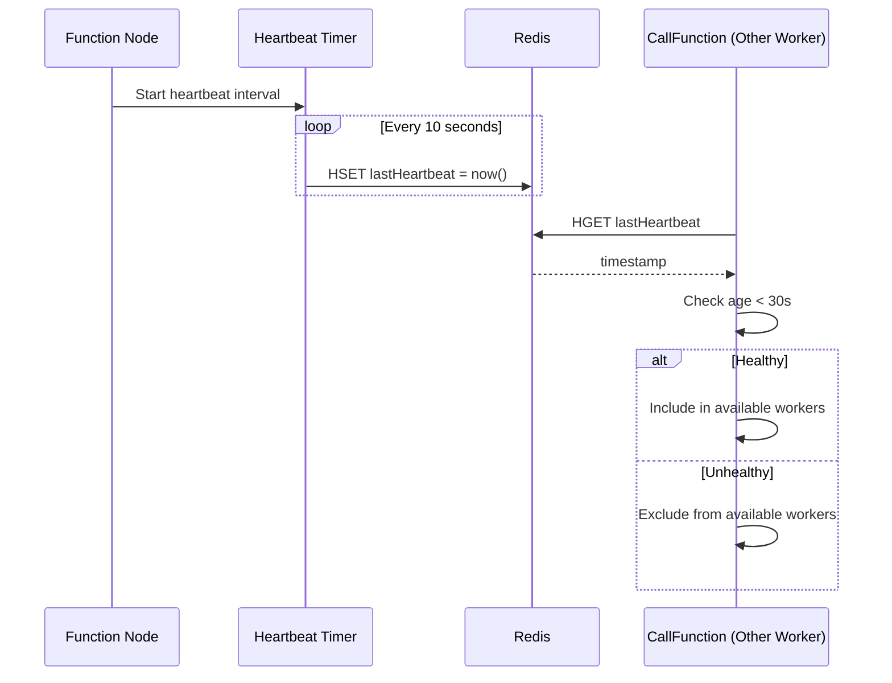
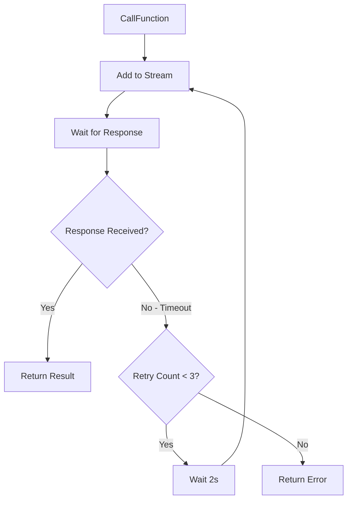

# Redis Queue Mode Architecture

## Overview

Redis queue mode enables Function nodes to work across multiple n8n worker processes in a distributed environment. Functions registered on any worker are discoverable and callable from all other workers through Redis Streams and metadata storage.

## Architecture Diagram



## Component Architecture

### 1. Bootstrap & Configuration



### 2. Function Registration (Stream-Based)



### 3. Function Discovery & Call Flow



### 4. Stream Processing Details



## Data Structures

### Redis Keys Structure

```
# Function Metadata (Hash)
function:meta:{workerId}:{functionName}
  - functionName: string
  - executionId: string (scope)
  - nodeId: string
  - parameters: JSON string
  - workerId: string
  - lastHeartbeat: timestamp

# Function Worker Sets (Set)
function:{functionName}
  - Contains worker IDs that have this function

# Function Streams (Stream)
function:stream:{scope}:{functionName}
  - Stream of function call requests

# Response Channels (List)
function:response:{callId}
  - Temporary list for response delivery

# Global Configuration (String)
function:global_config
  - JSON with queue mode settings
```

### Message Formats

#### Stream Message (Function Call)
```json
{
  "callId": "call-1234567890-abc123",
  "functionName": "ProcessOrder",
  "params": {
    "orderId": "12345",
    "action": "validate"
  },
  "inputItem": {
    "json": { "data": "..." },
    "binary": {}
  },
  "responseChannel": "function:response:call-1234567890-abc123",
  "timeout": "30000",
  "timestamp": "1234567890"
}
```

#### Response Message
```json
{
  "callId": "call-1234567890-abc123",
  "success": true,
  "data": {
    "processed": true,
    "result": "..."
  },
  "timestamp": 1234567890
}
```

## Worker Lifecycle

### 1. Worker Startup



### 2. Function Activation



### 3. Health Monitoring



## High Availability Features

### 1. Automatic Failover
- Workers continuously heartbeat to Redis
- Unhealthy workers (>30s without heartbeat) are automatically excluded
- Function calls only routed to healthy workers

### 2. Message Reliability
- Redis Streams ensure at-least-once delivery
- Consumer groups prevent message loss
- Unacknowledged messages can be reclaimed

### 3. Retry Mechanism


## Configuration

### Environment Variables (Auto-detected)
```bash
# Standard n8n queue mode variables
QUEUE_BULL_REDIS_HOST=redis
QUEUE_BULL_REDIS_PORT=6379
QUEUE_BULL_REDIS_DB=0
QUEUE_BULL_REDIS_USER=
QUEUE_BULL_REDIS_PASSWORD=
QUEUE_BULL_REDIS_SSL=false

# n8n queue mode flag
EXECUTIONS_MODE=queue
```

### ConfigureFunctions Node
- Stores global configuration in Redis
- Allows runtime Redis configuration changes
- Settings persist across all workers

## Performance Characteristics

### Latency
- **Function Discovery**: ~1-5ms (Redis SMEMBERS)
- **Stream Write**: ~1-2ms (XADD)
- **Response Wait**: ~5-20ms (includes processing)
- **Total Call Overhead**: ~10-30ms

### Throughput
- **Concurrent Functions**: Unlimited (Redis memory bound)
- **Calls/Second**: ~1000-5000 per function (depends on Redis)
- **Workers/Function**: Recommended 2-10 for redundancy

### Resource Usage
- **Redis Memory**: ~1KB per function registration
- **Stream Memory**: ~500 bytes per pending call
- **Network**: Minimal (binary protocol)

## Monitoring & Debugging

### Key Metrics to Monitor
```redis
# Active functions
KEYS function:meta:*

# Function workers
SMEMBERS function:{functionName}

# Pending messages
XPENDING function:stream:{scope}:{functionName} {groupName}

# Stream length
XLEN function:stream:{scope}:{functionName}
```

### Debug Logging
```bash
# Enable debug logs
export NODE_ENV=development
export N8N_LOG_LEVEL=debug

# Key log prefixes
🚀 Bootstrap operations
🎯 FunctionRegistry operations
🌊 Stream operations
🔧 CallFunction operations
⚙️ ConfigureFunctions operations
```

### Common Issues & Solutions

1. **"Function not found"**
   - Check worker health: `HGET function:meta:worker:name lastHeartbeat`
   - Verify function registered: `KEYS function:meta:*:functionName`
   - Check Redis connectivity

2. **Slow Function Calls**
   - Monitor stream length: `XLEN`
   - Check pending messages: `XPENDING`
   - Verify worker count is sufficient

3. **Workers Not Discovering Functions**
   - Ensure all workers use same Redis
   - Check `QUEUE_BULL_REDIS_*` variables
   - Verify bootstrap logs show Redis config

## Best Practices

### 1. Function Design
- Keep functions stateless
- Use unique, descriptive names
- Implement proper error handling
- Return serializable data only

### 2. Scaling
- Run 2-3 workers per critical function
- Monitor stream lengths
- Implement stream trimming for high-volume functions
- Use function scope to limit discovery overhead

### 3. Redis Configuration
```redis
# Recommended Redis settings
maxmemory-policy allkeys-lru
timeout 0
tcp-keepalive 60
```

### 4. Production Deployment
- Use Redis persistence (RDB/AOF)
- Configure Redis replication
- Monitor Redis memory usage
- Implement alerting for worker health

## Security Considerations

1. **Network Security**
   - Use Redis AUTH (password)
   - Enable SSL/TLS for Redis connections
   - Restrict Redis network access

2. **Data Security**
   - Avoid sensitive data in function parameters
   - Implement parameter validation
   - Use short TTLs for response channels

3. **Resource Limits**
   - Set max stream length
   - Implement function call rate limiting
   - Monitor for infinite loops

## Migration Guide

### From In-Memory to Queue Mode
1. Set `EXECUTIONS_MODE=queue`
2. Configure `QUEUE_BULL_REDIS_*` variables
3. Deploy ConfigureFunctions node
4. Restart all n8n instances
5. Functions automatically use Redis

### Rollback to In-Memory
1. Set `EXECUTIONS_MODE=regular`
2. Remove Redis environment variables
3. Restart n8n
4. Functions revert to in-memory mode