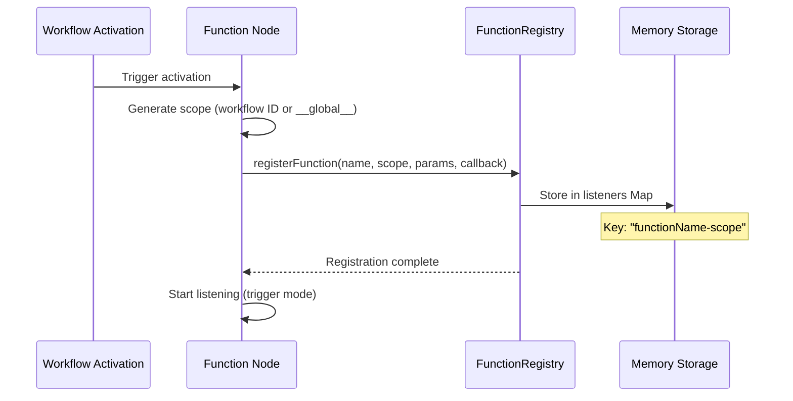
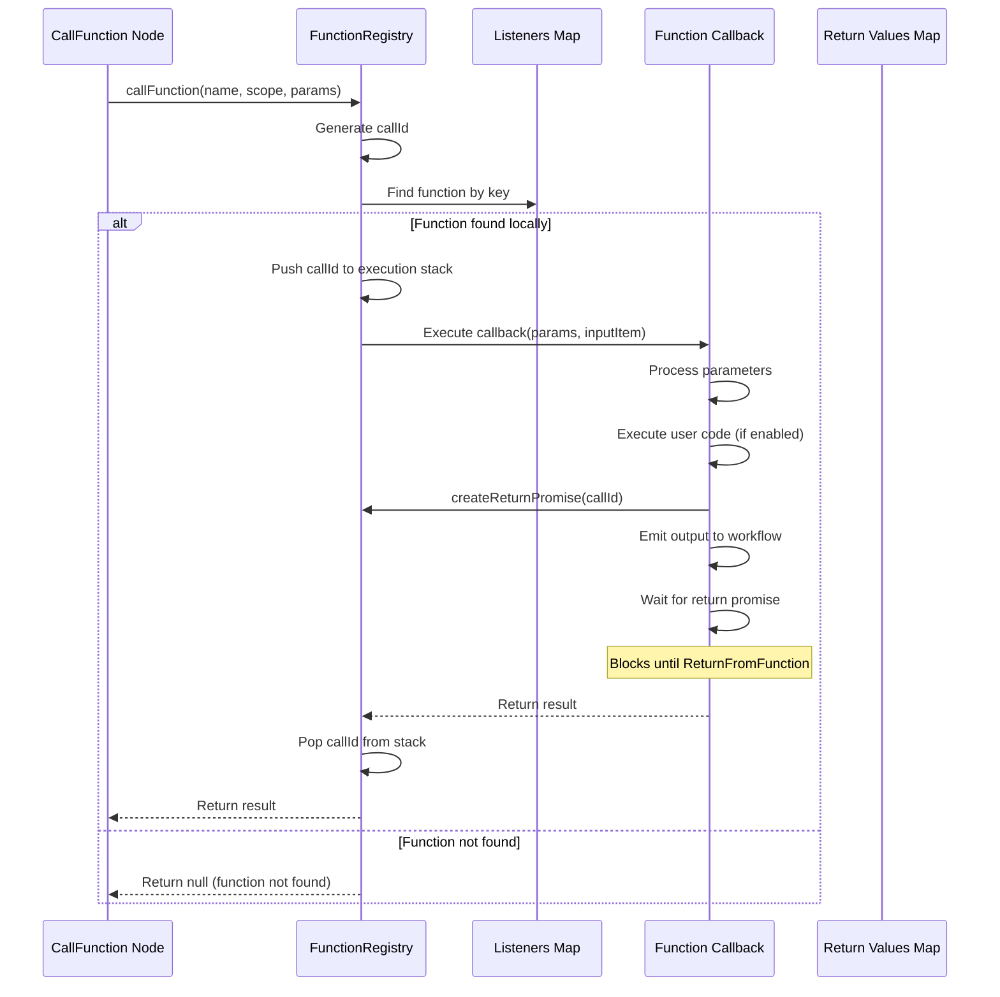
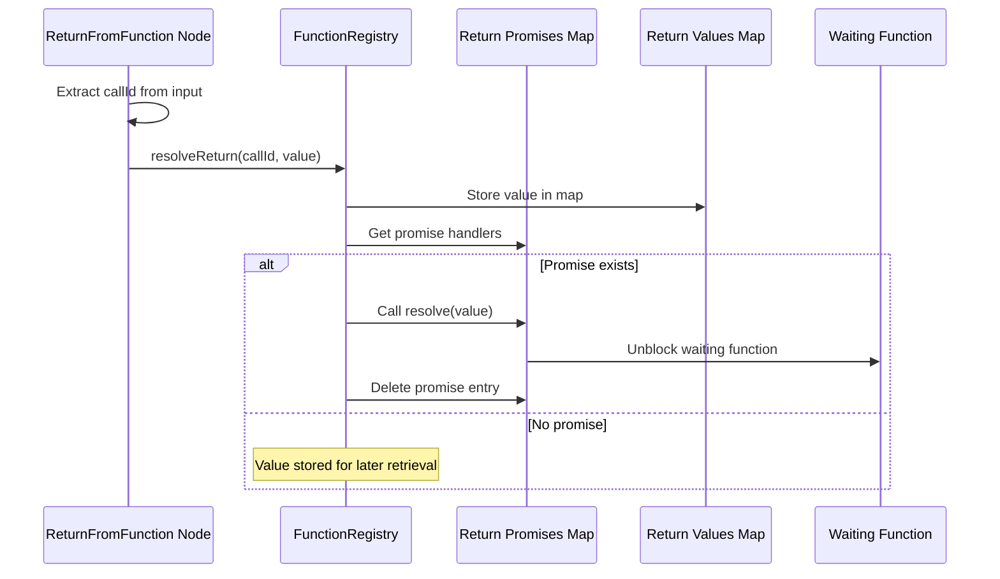
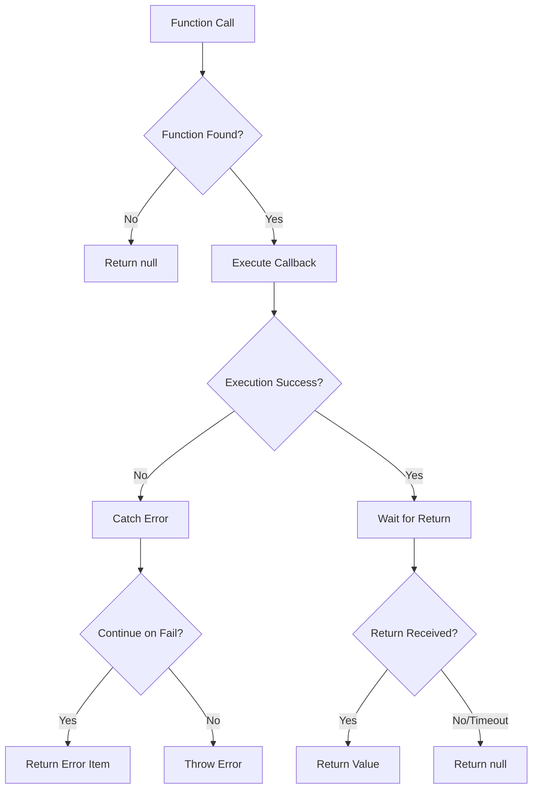

# In-Memory Mode Architecture

## Overview

In-memory mode is the default operation mode for n8n Function nodes when running in a single-process environment (non-queue mode). All function registrations, calls, and return values are handled within the same Node.js process memory space.

## Architecture Diagram

```mermaid
graph TB
    subgraph "n8n Single Process"
        subgraph "Workflow 1"
            F1[Function Node: 'Calculate Tax']
            CF1[CallFunction Node]
            RF1[ReturnFromFunction Node]
        end
        
        subgraph "Workflow 2"
            F2[Function Node: 'Format Data']
            CF2[CallFunction Node]
        end
        
        subgraph "FunctionRegistry (Singleton)"
            FR[FunctionRegistry Instance]
            
            subgraph "In-Memory Storage"
                L[listeners: Map<string, FunctionListener>]
                RV[inMemoryReturnValues: Map<string, any>]
                RP[returnPromises: Map<string, PromiseHandlers>]
                ES[executionStack: string[]]
            end
        end
        
        F1 -->|register| FR
        F2 -->|register| FR
        CF1 -->|call 'Calculate Tax'| FR
        CF2 -->|call 'Format Data'| FR
        RF1 -->|set return value| FR
        
        FR -->|execute callback| F1
        FR -->|execute callback| F2
        FR -->|retrieve return| CF1
    end
```

## Component Details

### 1. FunctionRegistry (Singleton)

The heart of the in-memory system. A single instance manages all function-related operations.

```typescript
class FunctionRegistry {
    private static instance: FunctionRegistry;
    private listeners: Map<string, FunctionListener> = new Map();
    private inMemoryReturnValues: Map<string, any> = new Map();
    private returnPromises: Map<string, PromiseHandlers> = new Map();
    private currentFunctionExecutionStack: string[] = [];
}
```

### 2. Function Registration Flow



### 3. Function Call Flow



### 4. Return Value Handling



## Key Components

### Function Node
- **Purpose**: Defines a callable function within a workflow
- **Scope**: Can be workflow-specific or global (`__global__`)
- **Storage**: Registers callback in FunctionRegistry's listeners map
- **Key Format**: `functionName-scope` (e.g., `CalculateTax-workflow123`)

### CallFunction Node
- **Purpose**: Invokes a registered function
- **Discovery**: Searches listeners map by function name and scope
- **Execution**: Direct callback invocation (synchronous in same process)
- **Return Handling**: Waits for ReturnFromFunction via promises

### ReturnFromFunction Node
- **Purpose**: Sets the return value for a function execution
- **Mechanism**: Resolves promises created during function call
- **Storage**: Values stored in `inMemoryReturnValues` map

### ConfigureFunctions Node
- **Purpose**: In in-memory mode, this node has no effect
- **Note**: Redis configuration is ignored when queue mode is disabled

## Data Structures

### FunctionListener
```typescript
interface FunctionListener {
    functionName: string;
    executionId: string;  // scope (workflow ID or __global__)
    nodeId: string;
    parameters: ParameterDefinition[];
    callback: (params: Record<string, any>, inputItem: INodeExecutionData) => Promise<INodeExecutionData[]>;
}
```

### Execution Context
- **Call ID**: Unique identifier for each function call
- **Format**: `worker-timestamp-randomId` (e.g., `worker-1234567890-abc123`)
- **Stack**: Maintains call hierarchy for nested function calls

## Lifecycle Management

### Workflow Activation
1. Function nodes register their callbacks in memory
2. Callbacks remain active while workflow is active
3. Functions are available immediately after registration

### Workflow Deactivation
1. Function nodes unregister from FunctionRegistry
2. Callbacks are removed from listeners map
3. Any pending return values are cleared

## Limitations

1. **Single Process Only**: Functions only accessible within the same Node.js process
2. **No Persistence**: All registrations lost on process restart
3. **No Cross-Workflow Calls**: Functions in different processes cannot communicate
4. **Memory Bound**: All data stored in process memory

## Performance Characteristics

- **Registration**: O(1) - Direct map insertion
- **Function Lookup**: O(1) - Map key lookup
- **Execution**: Synchronous, no network overhead
- **Return Values**: Promise-based, minimal overhead

## Error Handling



## Best Practices

1. **Unique Function Names**: Use descriptive, unique names within workflows
2. **Parameter Validation**: Always validate required parameters
3. **Error Handling**: Implement try-catch in function code
4. **Resource Cleanup**: Ensure workflows are properly deactivated
5. **Memory Management**: Avoid storing large objects in return values

## Configuration

No special configuration required. In-memory mode is automatically used when:
- `EXECUTIONS_MODE` is not set to `queue`
- No Redis configuration is provided
- Queue mode is explicitly disabled

## Debugging

Enable debug logging to trace function operations:
```bash
export NODE_ENV=development
export N8N_LOG_LEVEL=debug
```

Key log prefixes to watch:
- `🎯 FunctionRegistry:` - Core registry operations
- `🌊 Function:` - Function node operations
- `🔧 CallFunction:` - Function call operations
- `⭐` - Return value operations